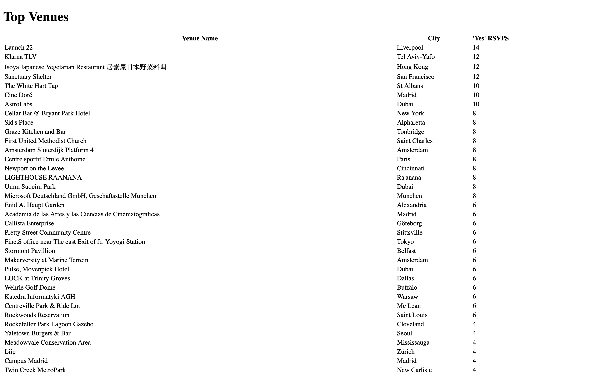
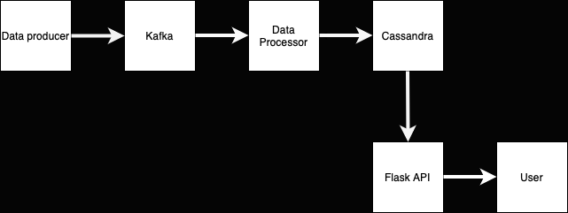

# Data pipeline for meetup rsvps

The solution implemented in this project is a real-time data processing pipeline that uses Apache Kafka, Apache Spark,
and Apache Cassandra technologies.
It simulates the generation of real-time data from a producer, which is then ingested and processed by a consumer in
real-time.
The processed data is stored in Cassandra, making it available for querying from Flask to create an endpoint.

## Running the solution

To run the solution:

`docker-compose up --build`

| Endpoint                             | Description                                     |
|--------------------------------------|-------------------------------------------------|
| http://localhost:5001/api/data       | Returns a json with the structure as below.     |
| http://localhost:5001/api/top_venues | Renders a html page with a table of top venues. |

### Example response of endpoint http://localhost:5001/api/data
```json
[
  {
    "count": 2,
    "group_city": "Abu Dhabi",
    "lat": "24.299173",
    "lon": "54.697277",
    "venue_name": "Change Works Offices"
  },
  {
    "count": 4,
    "group_city": "Maastricht",
    "lat": "50.85125",
    "lon": "5.71134",
    "venue_name": "Caracola Building, Maastricht"
  }
]
```

### Example response of endpoint http://localhost:5001/api/top_venues



## System Architecture



## Tools used and reasoning

### Zookeeper

Zookeeper is used in this project to ensure Kafka's robustness and performance.

### Kafka

Kafka is suitable for this project due to its capability to process high volumes of real-time data.

### Spark

Spark provides fast and distributed data processing, which is an obvious choice for real time streaming data.
This integrates well with Kafka.

### Cassandra

Cassandra is chosen because of its ability to handle large amounts of data across many servers therefore is scalable.

### Flask

Flask is suitable for this project due to its simplicity and ease of use for creating API endpoints.

## Implementation

### Kafka Producer (Data Producer)

The Kafka producer serves the role of ingesting data into my real-time data pipeline.
This is the entry point of my data, collecting it from the source and sending it to the Kafka topic.

### Kafka Consumer (Data Processor - Spark)

Data from Kafka is consumed by the Spark application.
It applies transformations on the raw data stream and writes the results to Cassandra in micro-batches.

### Cassandra (Data Storage)

Cassandra is used as my database.
The processed data from Spark is stored here.

### Flask API

A simple Flask web application is created to serve as an API endpoint.
It provides an interface for clients to retrieve processed data stored in Cassandra.

